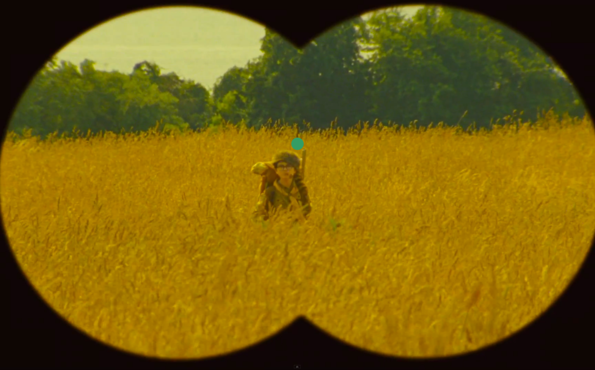

# WATCHSAFE

## Hack The Valley II

*watchsafe* uses **computer vision** to scan video clips for nsfw content by flagging the start and end of the nsfw content, and displaying the type of nsfw content (drugs/nudity/gore).

## Landing Page

## Loading Page

## Analytics Page

## Pitch

So online censorship. What’s the problem with it? Well, first of all, a human has to spend time watching the entire video, then they tag the video as NSFW. The entire video gets flagged - like in movie theatres, movies get rated R. But - why is that? What if there was a better way to do it? Think about movies like Apocalypse Now - movies with violent scenes that aren’t necessarily integral to the plot.

In our hack, WatchSafe, we used pre-trained computer vision models to scan an entire video, and flag the type of content and the start and finish of the content. Like, for example, 0:10 - 0:15 nudity. Then, we black out that part of the video clip.

So this has so many applications. Parents can use this when showing movies to kids, teachers can use it to show educational movies that adhere to school regulations, it can be used for crime scenes - it saves a lot of human viewing hours and catches things the human eye could miss.

	- how many frames per second?

So this is our demo, we have it rigged so you can change the threshold. The automatic threshold is 0.5, and we can adjust it based on how much we want to be censored.

### technology:
1. sightengine
2. python (flask)
3. deployed on microsoft azure

### challenges:
1. rate-limiting api
2. getting clarifai to return second of video

### applications:
1. nanny cam
2. teachers, parents showing movies
3. crime scenes

### primary goals:
1. be able to mark certain kinds of nsfw content
2. mark the start/end of nsfw content
3. deploy onto web app

### secondary goals:
1. chrome extension
2. live black-out
