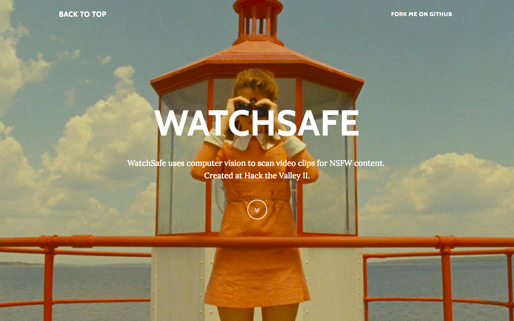
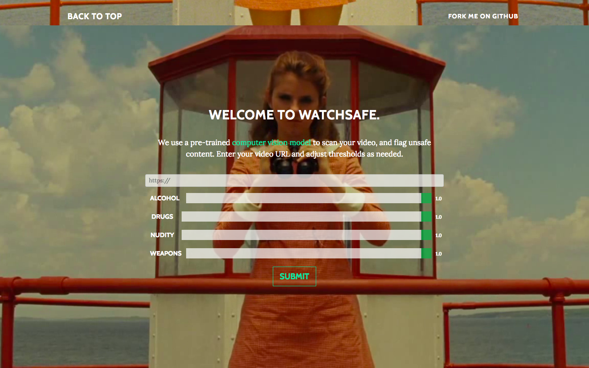

# WATCHSAFE

## Hack The Valley II

*WatchSafe* uses **computer vision** to scan video clips for inappropriate (NSFW) content. It tells you exactly what time in the video the NSFW content appears,and what type of inappropriate content it is: nudity, violence, drugs or alcohol. The user can choose a value from 0 to 1 for each category depending on how comfortable they are with that type of content.

WatchSafe uses WebSocket to do the analysis in real-time, and will not only tell you where the inappropriate content is, but also automatically censor the content for you.

## Demo
You can check out WatchSafe at http://www.watchingyour.tech. Folow the steps below: 
* Set the sliders to 0.6 or lower to see the video processed in real-time.
* Use https://s3.amazonaws.com/watchsafe/video-1519531020.mp4 as the video URL. This video has a mix of regular scenes, violence and alcohol.

As poor students without enough bandwith, we didn't set up the environment to censor the video in real-time. However, you can check out a video that we analyzed through WatchSafe and then censored [here](https://www.youtube.com/watch?v=_Wwa5B8vHKo "Video Demo")

[See Me on DevPost](https://devpost.com/software/watchsafe "See WatchSafe on DevPost")

### Landing Page

### Analytics Page

## About
WatchSafe uses computer vision to analyse video clips for NSFW content.

The problem with online censorship is that a human has to spend time watching the entire video, then they tag the video as NSFW. The entire video gets flagged - like in movie theatres, movies get rated R. But - why is that? Or parental controls - they just blacklist domains, preventing your child from watching educational content even if they wanted to. What if there was a better way to do it? Think about movies like Apocalypse Now - movies with violent scenes that aren’t necessarily integral to the plot.

### WatchSafe:
* uses pre-trained computer vision models to analyze an entire video
* flags the type of content (for nudity, violence, alcohol, and drugs) with adjustable threshold values
* Blacks out parts of the video clip, and embed it within the site for playback.
* Plots the results in real-time

Parents can use WatchSafe when showing movies to kids, teachers can use WatchSafe to show educational movies that adhere to school regulations, WatchSafe can be used for crime scenes - we save a lot of human viewing hours and catch things the human eye could miss.

### Technology
* Python (Flask) back-end, deployed on AWS (EB/EC2/S3)
* SightEngine API to analyze the video
* WebSocket (socket.io for Flask) to stream the results and update the front-end in real time
* Plot.ly for JS to display the results interactively
* MoviePy to censor the video

### Next Steps
In the future, we'd like to:
* implement real-time playback 
* move WatchSafe to a Chrome extension
* embed already analysed URLs in a MongoDB database so videos that are already analyzed do not need to be reprocessed

### Getting Started
Look in our /good folder for production-ready code.
